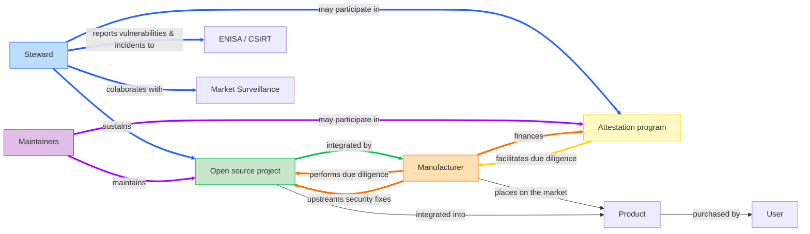

# Cyber Resilience SIG

Cyber Resilience Special Interest Group (SIG) of ORC WG.

## Meetings

* [Meeting info](../MEETINGS.md)
* [Minutes](./minutes/)

## Leads
* Dirk-Willem van Gulik ([@dirkx][]), The Apache Software Foundation
* Simon Phipps ([@webmink][]), Software Heritage Foundation - Inria Foundation
* Timo Perala ([@timop62][]), Nokia

## Scope

The Scope of the Cyber Resilience SIG is a strict subset of the scope of ORC WG. Whereas the working group is chartered to address any kind of emerging regulation impacting open source, the Cyber Resilience SIG is solely focused on cyber resilience regulation. Expect all of the CRA-related work to happen in this SIG.

In 2025, the SIG will focus on deliverables necessary to help the open source community (and notably _open source software stewards_) meet the regulatory obligations outlined in the CRA and help downstream users (_manufacturers_) be able to continue to leverage open source in their products and services while meeting their own regulatory requirements. This is expressed by the colored nodes and edges in the diagram below.

## Deliverables

| Deliverable name | Type | Owner | First draft due | Final draft due | 
|---|---|---|---|---|
| [CRA FAQ](#cra-faq) | Documentation | [FAQ Task Force][TFs] | April 2025 | June 2025 |
| [Inventory](#inventory) | Documentation | [Inventory Task Force][TFs] | April 2025 | June 2025 |
| [White paper on SBOMs](#white-paper-on-sboms) | White paper | Dedicated task force | April 2025 | June 2025 |
| [White paper on due diligence requirements for manufacturers](#white-paper-on-due-diligence-requirements-for-manufacturers) | White paper | Dedicated task force | | |
| [White paper on Attestations](#white-paper-on-attestations) | White paper | Dedicated task force | | |
| [Vulnerability Handling Specification](#vulnerability-handling-specification) | Specification | [Cyber Resilience Practices Project][] | March 2025 | |

| Deliverable name | License | First draft due | Final draft due | Input to | Relevant liaisons | Owner |
|---|---|---|---|---|---|---|
| Security policy for open source software stewards | CC-BY 4.0 / Apache 2.0 → [EFSL][] |  |  | EU Guidance, Implementing Act, ISO | EU Commission, CRA Expert Group, CEN/CENELEC, ISO | [Cyber Resilience Practices Project][] |
| Specification on principles for cyber resilience for open source development (based on Annex I, Part I, point (1)) | CC-BY 4.0 / Apache 2.0 → [EFSL][] |  |  | EU Guidance, Implementing Act, ISO | EU Commission, CRA Expert Group, CEN/CENELEC, ISO | [Cyber Resilience Practices Project][] |
| Specification on generic security requirements for open source components (based on Annex I, Part I, point (2)) | CC-BY 4.0 / Apache 2.0 → [EFSL][] |  |  | EU Guidance, Implementing Act, ISO | EU Commission, CRA Expert Group, CEN/CENELEC, ISO | [Cyber Resilience Practices Project][] |

### CRA FAQ

The [CRA FAQ](https://github.com/orcwg/cra-hub/blob/main/faq.md) represents a community effort to collect and answer frequently asked questions about the Cyber Resilience Act (CRA) as it relates to open source.  The purpose of this effort is twofold. First, consolidate community understanding of the CRA. Secondly, outline areas of the CRA which remain unclear and would benefit from Guidance from the European Commission.

A first version of the CRA FAQ will be contributed to the CRA Expert Group in advance of the group's next in-person meeting on June 5, 2025.

  
More info

  
* **Source:** <https://github.com/orcwg/cra-hub/blob/main/faq.md>
* **Type:** Documentation
* **License:** CC-BY 4.0
* **Owner:** [FAQ Task Force][TFs]
* **Input to:** EU Guidance 
* **Relevant liaisions**: EU Commission, CRA Expert Group 
* **First draft by:** June 2025
* **Final draft by:** 
    

### Inventory

The goal of the [Inventory](https://github.com/orcwg/cra-hub/blob/main/inventory.md) is to provide a comprehensive list of resources that are relevant to the CRA obligations of open-source software stewards and manufacturers when it comes to the development and usage of open source. The underlying purpose is to provide spericiation and standadisation effort with easy access to documented industry and community best practices when it comes to the development and integration of open source software and the interaction between developers and consumers of open source.

This inventory will be contributed to CEN/CENELEC and ETSI and to the CRA Expert Group.

  
More info

  
* **Source:** <https://github.com/orcwg/cra-hub/blob/main/inventory.md>
* **Type:** Documentation
* **License:** CC-BY 4.0
* **Owner:** [Inventory Task Force][TFs]
* **Input to:** Harmonised standards, ORC WG white papers and specifications
* **Relevant liaisions**: CEN/CENELEC
* **First draft by:** May 2025
* **Final draft by:** June 2025
    

### White paper on SBOMs

Software Bills of Materials (SBOMs) play a crucial role in the implementation of the Cyber Resilience Act (CRA), in particular for vulnerability handling. Yet, there are no agreed-upon best practices for the usage and adoption of SBOMs across open source communities and numerous misunderstandings about how they work. There are competing standards, disagreements about whether open source projects should provide SBOMs or whether they're artifacts that integrators of open source components should generate, disagreements about the data they should contain, and a general lack of neutral information on the topic.

The goal of this white paper is to fill this gap by providing commonly agreed upon information about SBOMs and their role in the open source ecosystem and provide recommendations for their adoption in the context of the CRA.

This white paper will leverage the resources collected in the [Inventory](#inventory) and will be contributed to EU Commission, the CRA Expert Group, and CEN/CENELEC.

  
More info

  
* **Source:** TBD
* **Type:** White paper
* **License:** CC-BY 4.0
* **Owner:** Dedicated Task Force
* **Input to:** EU Guidance, Implementing Act, Harmonised standards
* **Relevant liaisions**: EU Commission, CRA Expert Group, CEN/CENELEC
* **First draft by:** April 2025
* **Final draft by:** June 2025
    

### White paper on due diligence requirements for manufacturers

The due diligence requirements for manufacturers outlined in [Article 13(5)](https://eur-lex.europa.eu/legal-content/EN/TXT/HTML/?uri=OJ:L_202402847#art_13) of the CRA are the corner stone of the relationship between manufacturers and the open source ecosystem.

This white paper will attempt to clarify these due diligence requirements, list the constraints manufacturers might face when integrating open source components—in particular components which aren't supported by open source software stewards—and propose solutions to enable manufacturers to continue leveraging open source components securily despite those constraints.

This white paper will be shared with the EU Commission and the CRA Expert Group and will provide important context for the [Specification on generic security requirements for open source components](#specification-on-generic-security-requirements-for-open-source-components) described below.

  
More info

  
* **Source:** TBD
* **Type:** White paper
* **License:** CC-BY 4.0
* **Owner:** Dedicated Task Force
* **Input to:** EU Guidance, Implementing Act, Harmonised standards
* **Relevant liaisions**: EU Commission, CRA Expert Group, CEN/CENELEC
* **First draft by:** 
* **Final draft by:**
    

### White paper on attestations

  
More info

  
* **Source:** TBD
* **Type:** White paper
* **License:** CC-BY 4.0
* **Owner:** Dedicated Task Force
* **Input to:** EU Guidance, Implementing Act, Harmonised standards
* **Relevant liaisions**: EU Commission, CRA Expert Group, CEN/CENELEC
* **First draft by:** 
* **Final draft by:**
    

### Vulnerability Handling Specification

The [Vulnerability Handling Specification](https://github.com/orcwg/vulnerability-management-spec/blob/main/spec.md) focuses on vulnerability management for products with digital elements, as outlined by the Essential Requirements of the CRA. It details the necessary components of a vulnerability handling policy, including procedures for receiving reports, resolving issues, and disclosing vulnerabilities. Additionally, it specifies the requirements for managing vulnerable dependencies.

The Vulnerability Handling Specification, along with related input will be shared with CEN/CENELEC as contribution to the [Harmonised Standard on vulnerability handling](https://github.com/orcwg/cra-hub/blob/main/standards.md#milestone-1---horizontal-standards-due-august-30-2026).

  
More info

  
* **Source:** <https://github.com/orcwg/vulnerability-management-spec/blob/main/spec.md>
* **Type:** Specification
* **License:** CC-BY 4.0 or Apache 2.0
* **Final license**: [EFSL][]
* **Owner:** [Cyber Resilience Practices Project][]
* **Input to:** Harmonised standards
* **Relevant liaisions**: CEN/CENELEC
* **First draft by:** May 2025
* **Final draft by:** 
    

### Specification on generic security requirements for open source components

## Cyber Resilience Practices Project

* [Proposal for the Cyber Resilience Practices Project](https://projects.eclipse.org/projects/technology.crp)

### Project leads
* Dirk-Willem van Gulik ([@dirkx][]), The Apache Software Foundation
* Mikael Barbero ([@mbarbero][]), Eclipse Foundation
* Simon Phipps ([@webmink][]), Software Heritage Foundation - Inria Foundation
* Timo Perala ([@timop62][]), Nokia

## Task Forces

The Cyber Resilience SIG can form task forces that focus on a particular topic for a fixed period of time.

A task force must must have one or more leads, an area of focus, a set of deliverables, and an end date by which it must present its deliverables and recommendations to the SIG and/or request an extension.

A task force's proceedings are public.

Task forces do not have any decision-making authority. Their role is advisory. Their deliverables do not represent the consensus of the SIG nor of the WG unless the SIG or WG formally adopts them.

### Current task forces

| Name | Focus Area | Lead(s) | Deliverables | Minutes | End date | 
|---|---|---|---|---|---|
| Deliverables Plan Task Force | Define a deliverables plan for the SIG for 2025 | Tobie Langel ([@tobie](https://github.com/tobie)) | Deliverables Plan | [Minutes](./minutes/deliverables-plan-task-force) | 2025-03-03 |
| FAQ Task Force | Collect, answer, and organize questions from the community on the CRA | [@orcwg/faq-task-force-leads](https://github.com/orgs/orcwg/teams/faq-task-force-leads) | [FAQ](https://github.com/orcwg/cra-hub/blob/main/faq.md) | [Minutes](./minutes/faq-task-force) | 2025-06-30 |
| Inventory Task Force | Collect and organize resources relevant to the implementation of the CRA | [@orcwg/inventory-task-force-leads](https://github.com/orgs/orcwg/teams/inventory-task-force-leads) | [Inventory](https://github.com/orcwg/cra-hub/blob/main/inventory.md) | [Minutes](./minutes/inventory-task-force) | 2025-06-30 |

## Why a Cyber Resilience SIG?

ORC WG is chartered to address any regulation impacting open source communities and open source usage. It can establish Special Interest Groups (SIGs) for domain-specific work. 

The initial focus of ORC WG is to help open source communities and the broader tech industry better understand and prepare to meet the compliance requirements of the European Cyber Resilience Act (CRA). However, cyber resilience is a topic that is broader than Europe. And ORC WG aims to facilitate compliance _across jurisdictions_ (and not only in the EU). A SIG focused on cyber resilience in general--not just on the CRA--will help achieve this goal.

As new regulations impacting open source communities emerge, it is expected that additional SIGs modeled on this initial one will be formed.

[@dirkx]: https://github.com/dirkx
[@timop62]: https://github.com/timop62
[@mbarbero]: https://github.com/mbarbero
[@webmink]: https://github.com/webmink

[EFSL]: https://www.eclipse.org/legal/efsl/
[TFs]: #current-task-forces
[Cyber Resilience Practices Project]: #cyber-resilience-practices-project
