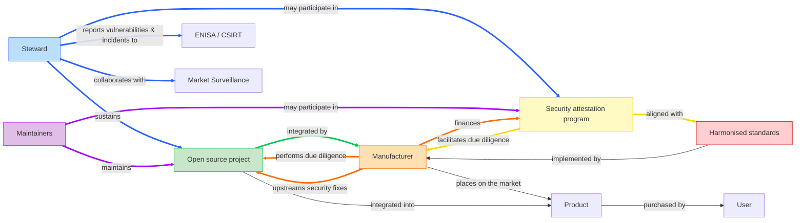
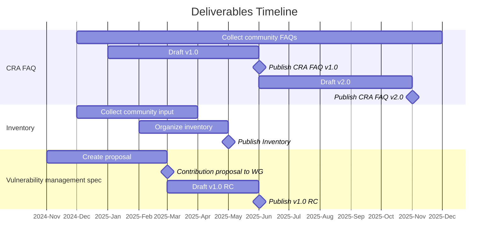

# Cyber Resilience SIG

Cyber Resilience Special Interest Group (SIG) of ORC WG.

## Meetings

* [Meeting info](../MEETINGS.md)
* [Minutes](./minutes/)

## Leads
* Dirk-Willem van Gulik ([@dirkx][]), The Apache Software Foundation
* Simon Phipps ([@webmink][]), Software Heritage Foundation - Inria Foundation
* Timo Perala ([@timop62][]), Nokia

## Scope

The Scope of the Cyber Resilience SIG is a strict subset of the scope of ORC WG. Whereas the working group is chartered to address any kind of emerging regulation impacting open source, the Cyber Resilience SIG is solely focused on cyber resilience regulation. Expect all of the CRA-related work to happen in this SIG.

## Deliverable Plan

In 2025, the SIG will focus on deliverables necessary to help the open source community (and notably _open source software stewards_) meet the regulatory obligations outlined in the CRA and help downstream users (_manufacturers_) be able to continue to leverage open source in their products and services while meeting their own regulatory requirements. This is expressed by the colored nodes and edges in the diagram below.

### Equivalence between products and for open source components

The CRA focuses mainly on the compliance of products, but that doesn't mean that there aren't equivalent concepts for some of the key requirements for products targeted at open source components. Here's a table comparing both products and open source and referencing relevant Cyber Resilience SIG deliverables for each

| Role | For products | Equivalent for open source components | Relevant deliverables |
|---|---|---|---|
| Compliance requirements | Ensure product is designed, developed and produced in accordance with the essential cybersecurity requirements | Exercise due diligence | [White paper on due diligence][due diligence] | 
| Helps meet compliance requirements | CEN/CENELEC and ETSI harmonised standards | ORC WG specifications | [Principles for cyber resilience][cyber resilience principles] and [Generic security requirements] specs |
| Indicates compliance | CE Mark | Attestation program | [White paper on attestations][security attestations] | 
| Provides information to users | Technical documentation | Attestation program | White papers on [attestations][security attestations] and [due diligence][]|
| Manage vulnerabilities | CEN/CENELEC and ETSI harmonised standards | ORC WG specification | [Vulnerability management spec][vulnerability management] |

### Deliverables

| Deliverable name | Type | Owner | First draft due | Final draft due | 
|---|---|---|---|---|
| [CRA FAQ][FAQ] | Documentation | [FAQ Task Force][TFs] | April 2025 | June 2025 |
| [inventory][] | Documentation | [Inventory Task Force][TFs] | April 2025 | June 2025 |
| [White paper on SBOMs][SBOMs] | White paper | Dedicated task force | April 2025 | June 2025 |
| [White paper on due diligence obligation of manufacturers][due diligence] | White paper | Dedicated task force | | |
| [White paper on Attestations][security attestations] | White paper | Dedicated task force | | |
| [Vulnerability management specification][vulnerability management] | Specification | [Cyber Resilience Practices Project][] | March 2025 | |
| [Specification on principles for cyber resilience for open source development][cyber resilience principles] | Specification | [Cyber Resilience Practices Project][] | | |
| [Specification on generic security requirements for open source components][generic security requirements] | Specification | [Cyber Resilience Practices Project][] | | |
| [Security policy for open source software stewards][security policy] | Specification | [Cyber Resilience Practices Project][] | | |

_Note that, at the discretion of the [SIG leads](#leads), the Cyber Resilience SIG is empowered to create additional white papers to address pressing issues, support existing deliverables, or provided input to the European Commission, ENISA, the CRA Expert Group, the European Standards Organisations, Market Surveillance Authorities, or any other relevant institution._

#### CRA FAQ

The [CRA FAQ](https://github.com/orcwg/cra-hub/blob/main/faq.md) represents a community effort to collect and answer frequently asked questions about the Cyber Resilience Act (CRA) as it relates to open source.  The purpose of this effort is twofold. First, consolidate community understanding of the CRA. Secondly, outline areas of the CRA which remain unclear and would benefit from Guidance from the European Commission.

A first version of the CRA FAQ will be contributed to the CRA Expert Group in advance of the group's next in-person meeting on June 5, 2025.

  
More info

  
* **Source:** <https://github.com/orcwg/cra-hub/blob/main/faq.md>
* **Type:** Documentation
* **License:** CC-BY 4.0
* **Owner:** [FAQ Task Force][TFs]
* **Input to:** EU Guidance 
* **Relevant liaisions**: EU Commission, CRA Expert Group 
* **First draft by:** June 2025
* **Final draft by:** 
    

#### Inventory

The goal of the [Inventory](https://github.com/orcwg/cra-hub/blob/main/inventory.md) is to provide a comprehensive list of resources that are relevant to the CRA obligations of open-source software stewards and manufacturers when it comes to the development and usage of open source. The underlying purpose is to provide specification and standardization effort with easy access to documented industry and community best practices related to the development and integration of open source software and to the interactions between developers and consumers of open source.

This inventory will be contributed to CEN/CENELEC and ETSI and to the CRA Expert Group.

  
More info

  
* **Source:** <https://github.com/orcwg/cra-hub/blob/main/inventory.md>
* **Type:** Documentation
* **License:** CC-BY 4.0
* **Owner:** [Inventory Task Force][TFs]
* **Input to:** Harmonised standards, ORC WG white papers and specifications
* **Relevant liaisions**: CEN/CENELEC
* **First draft by:** May 2025
* **Final draft by:** June 2025
    

#### White paper on SBOMs

Software Bills of Materials (SBOMs) play a crucial role in the implementation of the Cyber Resilience Act (CRA), in particular for vulnerability handling. Yet, there are no agreed-upon best practices for the usage and adoption of SBOMs across open source communities and numerous misunderstandings about how they work. There are competing standards, disagreements about whether open source projects should provide SBOMs or whether they're artifacts that integrators of open source components should generate, disagreements about the data they should contain, and a general lack of neutral information on the topic.

The goal of this white paper is to fill this gap by providing commonly agreed upon information about SBOMs and their role in the open source ecosystem and provide recommendations for their adoption in the context of the CRA.

This white paper will leverage the resources collected in the [inventory][] and will be contributed to the EU Commission, the CRA Expert Group, and CEN/CENELEC.

  
More info

  
* **Source:** TBD
* **Type:** White paper
* **License:** CC-BY 4.0
* **Owner:** Dedicated Task Force
* **Input to:** EU Guidance, Implementing Act, Harmonised standards
* **Relevant liaisons**: EU Commission, CRA Expert Group, CEN/CENELEC
* **First draft by:** April 2025
* **Final draft by:** June 2025
    

#### White paper on due diligence obligation of manufacturers

The due diligence obligation of manufacturers outlined in [Article 13(5)][] of the CRA is the cornerstone of the relationship between manufacturers and the open source ecosystem.

This white paper will attempt to clarify this obligation along with the related requirement that integrated open source components must not compromise the cybersecurity of the products they are integrated into. It will list the constraints manufacturers might face when integrating open source components—in particular components which aren't supported by open source software stewards, and propose solutions to enable manufacturers to continue leveraging open source components securely and at scale despite those constraints.

Secondly, this paper will outline steps that open source projects could take to help facilitate this due diligence obligation—notably by providing increased transparency about their security posture, recommend existing standards or specification that projects could adopt, and propose new ones where appropriate.

Finally, this paper will examine the tension between the practical necessity for manufacturers to shift security left (i.e. with the open source projects) and their inability to compel those projects to take on this responsability—given that compliance obligations rightfully rest with the manufacturers—and will underline the need for incentives-aligning mechanisms to resolve this tension.

This white paper will be shared with the EU Commission and the CRA Expert Group and will provide important context for the [Specification on generic security requirements for open source components](#specification-on-generic-security-requirements-for-open-source-components) described below.

Note: This white paper might be combined with the paper on [security attestations][] described below.

  
More info

  
* **Source:** TBD
* **Type:** White paper
* **License:** CC-BY 4.0
* **Owner:** Dedicated Task Force
* **Input to:** EU Guidance, Implementing Act, Harmonised standards
* **Relevant liaisons**: EU Commission, CRA Expert Group, CEN/CENELEC
* **First draft by:** 
* **Final draft by:**
    

#### White paper on security attestations

[Article 25][] of the CRA introduces security attestations for free and open-source software as a mechanism to facilitate the due diligence obligation of manufacturers when integrating open source components. While the white paper on due diligence will explore _what_ this due diligence obligation is and examine the tension between the practical necessity for manufacturers to shift security left and their inability to compel open source projects to take on this additional responsibility, this paper will explore _how_ security attestation can be used as a mechanism to resolve this tension and create incentives-alignment between manufacturers and open source projects.

Thanks to case studies of similar mechanisms, for example the [Ecosystem Sustainability Program (ESP)](https://openjsf.org/blog/ecosystem-sustainability-program) developed by the OpenJS Foundation, this paper will propose possible implementations of this mechanism that would allow open source projects and stewards to support manufacturers beyond their obligations and receive support (financial or otherwise) through the security attestation programs.

Note: This white paper might be combined with the paper on [due diligence][] described above.

  
More info

  
* **Source:** TBD
* **Type:** White paper
* **License:** CC-BY 4.0
* **Owner:** Dedicated Task Force
* **Input to:** EU Guidance, Implementing Act, Harmonised standards
* **Relevant liaisons**: EU Commission, CRA Expert Group, CEN/CENELEC
* **First draft by:** 
* **Final draft by:**
    

#### Vulnerability management specification

The [Vulnerability management specification](https://github.com/orcwg/vulnerability-management-spec/blob/main/spec.md) focuses on vulnerability management for open source codebases. It details the necessary components of a vulnerability management policy, including procedures for receiving reports, resolving issues, and disclosing vulnerabilities. Additionally, it specifies the requirements for managing vulnerable dependencies.

Although the initial motivitation for this specification is to help compliance with the essential requirements of the CRA, the intention is for this specification to be agnostic of a particular legislation.

The Vulnerability management specification, along with related input will be shared with CEN/CENELEC as contribution to the [Harmonised Standard on vulnerability handling](https://github.com/orcwg/cra-hub/blob/main/standards.md#milestone-1---horizontal-standards-due-august-30-2026).

  
More info

  
* **Source:** <https://github.com/orcwg/vulnerability-management-spec/blob/main/spec.md>
* **Type:** Specification
* **License:** CC-BY 4.0 or Apache 2.0
* **Final license**: [EFSL][]
* **Owner:** [Cyber Resilience Practices Project][]
* **Input to:** Harmonised standards
* **Relevant liaisons**: CEN/CENELEC
* **First draft by:** May 2025
* **Final draft by:** 
    

#### Specification on principles for cyber resilience for open source

This specification is intended to be somewhat of an equivalent of the type A horizontal standard that addresses the requirements spelled out in  [Annex I, Part I, point (1)][] but specifically targeted at the development of open source components and with a focus on the due diligence obligations of manufacturers. It will build on the white papers on [SBOMS][], [due diligence][], and [security attestations][] mentioned above.

This specification aims to address the following issue:

1. Provide a specification that is freely accessible and royalty-free so that open source projects can implement it.
2. Formalize recognized good practices that improve the security posture of open source projects.
3. Provide a machine-readable way (for example through dedicated SBOM fields) for open source projects to document and transparently share factual information about the cyber resilience practices that they implement in order to faciliate the due diligence of manufacturers.
4. Help resolve the challenge of assessing risk for components whose use-cases aren't known at the time of development, by providing transparency on the project's posture to manufactueres integrating them, allowing them to carry out their own risk assessment as part of their due diligence obligations.

Where appropriate, this specification will reference and build on exsiting material, notably collected in the [inventory][]. It may be broken down into separare documents.

Note: The challenge of assessing risk for components whose use-cases aren't known at the time of development might benefit from its own white paper.

  
More info

  
* **Source:** 
* **Type:** Specification
* **License:** CC-BY 4.0 or Apache 2.0
* **Final license**: [EFSL][]
* **Owner:** [Cyber Resilience Practices Project][]
* **Input to:** ISO
* **Relevant liaisons**: EU Commission, CRA Expert Group, CEN/CENELEC
* **First draft by:**
* **Final draft by:** 
    

#### Specification on generic security requirements for open source components

This specification is intended to addresses the requirements spelled out in [Annex I, Part I, point (2)][] but specifically targeted at the development of open source components and with a focus on the due diligence obligations of manufacturers. In that sence it is somewhat in between the type B horizontal standards and vertical standards and is sometimes referred to as a "broad vertical."

It will build on the white papers on [SBOMS][], [due diligence][], and [security attestations][] mentioned above and work closely with the [Specification on principles for cyber resilience for open source development][cyber resilience principles] mentioned above.

This specification will provide a machine-readable way (for example through dedicated SBOM fields) for open source projects to document and transparently share factual information about which cyber security requirements defined in [Annex I, Part I, point (2)][] are relevant to the project, whether they are addressed by the project, or whether they need to be handled by the integrator.

  
More info

  
* **Source:** 
* **Type:** Specification
* **License:** CC-BY 4.0 or Apache 2.0
* **Final license**: [EFSL][]
* **Owner:** [Cyber Resilience Practices Project][]
* **Input to:** ISO
* **Relevant liaisons**: EU Commission, CRA Expert Group, CEN/CENELEC
* **First draft by:**
* **Final draft by:** 
    

#### Security policy for open source software stewards

[Article 24(1)] of the CRA states that _"open-source software stewards shall put in place and document in a verifiable manner a cybersecurity policy to foster the development of a secure product with digital elements as well as an effective handling of vulnerabilities by the developers of that product."_ This specification will help open source software stewards meet their obligations by specifying minimum requirements that stewards must implement to meet them and provide a structure or format to document their cybersecurity  policy, possibly in a machine-readable way.

This specification will leverage existing resources and best practies as identified in our [inventory][] and will interact closely with the [Vulnerability management specification][vulnerability management] and the [Specification on principles for cyber resilience for open source development][cyber resilience principles] described above.

  
More info

  
* **Source:** 
* **Type:** Specification
* **License:** CC-BY 4.0 or Apache 2.0
* **Final license**: [EFSL][]
* **Owner:** [Cyber Resilience Practices Project][]
* **Input to:** ISO
* **Relevant liaisons**: EU Commission, CRA Expert Group, CEN/CENELEC
* **First draft by:** May 2025
* **Final draft by:** 
    

## Cyber Resilience Practices Project

* [Proposal for the Cyber Resilience Practices Project](https://projects.eclipse.org/projects/technology.crp)

### Project leads
* Dirk-Willem van Gulik ([@dirkx][]), The Apache Software Foundation
* Mikael Barbero ([@mbarbero][]), Eclipse Foundation
* Simon Phipps ([@webmink][]), Software Heritage Foundation - Inria Foundation
* Timo Perala ([@timop62][]), Nokia

## Task Forces

The Cyber Resilience SIG can form task forces that focus on a particular topic for a fixed period of time.

A task force must have one or more leads, an area of focus, a set of deliverables, and an end date by which it must present its deliverables and recommendations to the SIG and/or request an extension.

A task force's proceedings are public.

Task forces do not have any decision-making authority. Their role is advisory. Their deliverables do not represent the consensus of the SIG nor of the WG unless the SIG or WG formally adopts them.

### Current task forces

| Name | Focus Area | Lead(s) | Deliverables | Minutes | End date | 
|---|---|---|---|---|---|
| Deliverables Plan Task Force | Define a deliverables plan for the SIG for 2025 | Tobie Langel ([@tobie](https://github.com/tobie)) | Deliverables Plan | [Minutes](./minutes/deliverables-plan-task-force) | 2025-03-03 |
| FAQ Task Force | Collect, answer, and organize questions from the community on the CRA | [@orcwg/faq-task-force-leads](https://github.com/orgs/orcwg/teams/faq-task-force-leads) | [FAQ](https://github.com/orcwg/cra-hub/blob/main/faq.md) | [Minutes](./minutes/faq-task-force) | 2025-06-30 |
| Inventory Task Force | Collect and organize resources relevant to the implementation of the CRA | [@orcwg/inventory-task-force-leads](https://github.com/orgs/orcwg/teams/inventory-task-force-leads) | [Inventory](https://github.com/orcwg/cra-hub/blob/main/inventory.md) | [Minutes](./minutes/inventory-task-force) | 2025-06-30 |

## Why a Cyber Resilience SIG?

ORC WG is chartered to address any regulation impacting open source communities and open source usage. It can establish Special Interest Groups (SIGs) for domain-specific work. 

The initial focus of ORC WG is to help open source communities and the broader tech industry better understand and prepare to meet the compliance requirements of the European Cyber Resilience Act (CRA). However, cyber resilience is a topic that is broader than Europe. And ORC WG aims to facilitate compliance _across jurisdictions_ (and not only in the EU). A SIG focused on cyber resilience in general--not just on the CRA--will help achieve this goal.

As new regulations impacting open source communities emerge, it is expected that additional SIGs modeled on this initial one will be formed.

[@dirkx]: https://github.com/dirkx
[@timop62]: https://github.com/timop62
[@mbarbero]: https://github.com/mbarbero
[@webmink]: https://github.com/webmink

[EFSL]: https://www.eclipse.org/legal/efsl/
[TFs]: #current-task-forces
[Cyber Resilience Practices Project]: #cyber-resilience-practices-project

[Article 13(5)]: https://eur-lex.europa.eu/legal-content/EN/TXT/HTML/?uri=OJ:L_202402847#art_13
[Article 24(1)]: https://eur-lex.europa.eu/legal-content/EN/TXT/HTML/?uri=OJ:L_202402847#art_24
[Article 25]: https://eur-lex.europa.eu/legal-content/EN/TXT/HTML/?uri=OJ:L_202402847#art_25
[Annex I, Part I, point (1)]: https://eur-lex.europa.eu/legal-content/EN/TXT/HTML/?uri=OJ:L_202402847#anx_I
[Annex I, Part I, point (2)]: https://eur-lex.europa.eu/legal-content/EN/TXT/HTML/?uri=OJ:L_202402847#anx_I

[FAQ]: #cra-faq
[inventory]: #inventory 
[SBOMs]: #white-paper-on-sboms
[due diligence]: #white-paper-on-due-diligence-obligation-of-manufacturers
[security attestations]: #white-paper-on-security-attestations
[vulnerability management]: #vulnerability-management-specification
[cyber resilience principles]: #specification-on-principles-for-cyber-resilience-for-open-source 
[generic security requirements]:#specification-on-generic-security-requirements-for-open-source-components
[security policy]: #security-policy-for-open-source-software-stewards
