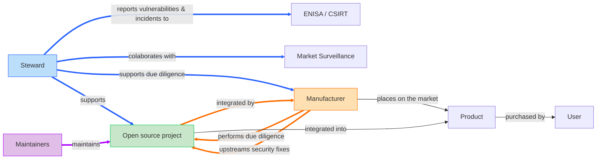

# Cyber Resilience SIG

Cyber Resilience Special Interest Group (SIG) of ORC WG.

## Scope

The Scope of the Cyber Resilience SIG is a strict subset of the scope of ORC WG. Whereas the working group is chartered to address any kind of emerging regulation impacting open source, the Cyber Resilience SIG is solely focused on cyber resilience regulation. Expect all of the CRA-related work to happen in this SIG.

In 2025, the SIG will focus on deliverables necessary to help the open source community (and notably _open source software stewards_) meet the regulatory obligations outlined in the CRA and help downstream users (_manufacturers_) be able to continue to leverage open source in their products and services while meeting their own regulatory requirements. This is expressed by the colored nodes and edges in the diagram below.

## Deliverables

| Deliverable name | License | First draft due | Final draft due | Input to | Relevant liaisons | Owner |
|---|---|---|---|---|---|---|
| [FAQ](https://github.com/orcwg/cra-hub/blob/main/faq.md) | CC-BY 4.0 | April 2025 |  | EU Guidance | EU Commission, CRA Expert Group | [FAQ Task Force][TFs] |
| [Inventory](https://github.com/orcwg/cra-hub/blob/main/inventory.md) | CC-BY 4.0 | April 2025 |  | Harmonized Standards, ORC WG | CEN/CENELEC | [Inventory Task Force][TFs] |
| Vulnerability Handling Specification | CC-BY 4.0 / Apache 2.0 → [EFSL][] | April 2025 |  | Harmonized Standards | CEN/CENELEC, ISO | Cyber Resilience Practices Project |
| White paper on SBOMs | CC-BY 4.0 | | | EU Guidance, Implementing Act | EU Commission, CRA Expert Group |  |
| Due diligence requirements for manufacturers | CC-BY 4.0 |  |  | EU Guidance, Implementing Act | EU Commission, CRA Expert Group |  |
| Security policy for open source software stewards | CC-BY 4.0 / Apache 2.0 → [EFSL][] |  |  | EU Guidance, Implementing Act, ISO | EU Commission, CRA Expert Group, CEN/CENELEC, ISO | Cyber Resilience Practices Project |
| Specification on principles for cyber resilience for open source development (based on Annex I, Part I, point (1)) | CC-BY 4.0 / Apache 2.0 → [EFSL][] |  |  | EU Guidance, Implementing Act, ISO | EU Commission, CRA Expert Group, CEN/CENELEC, ISO | Cyber Resilience Practices Project |
| White paper on Attestations | CC-BY 4.0 | | | EU Guidance, Implementing Act | EU Commission, CRA Expert Group |  |
| Specification on generic security requirements for open source components (based on Annex I, Part I, point (2)) | CC-BY 4.0 / Apache 2.0 → [EFSL][] |  |  | EU Guidance, Implementing Act, ISO | EU Commission, CRA Expert Group, CEN/CENELEC, ISO | Cyber Resilience Practices Project |

## Task Forces

The Cyber Resilience SIG can form task forces that focus on a particular topic for a fixed period of time.

A task force must must have one or more leads, an area of focus, a set of deliverables, and an end date by which it must present its deliverables and recommendations to the SIG and/or request an extension.

A task force's proceedings are public.

Task forces do not have any decision-making authority. Their role is advisory. Their deliverables do not represent the consensus of the SIG nor of the WG unless the SIG or WG formally adopts them.

### Current task forces

| Name | Focus Area | Lead(s) | Deliverables | Minutes | End date | 
|---|---|---|---|---|---|
| Deliverables Plan Task Force | Define a deliverables plan for the SIG for 2025 | Tobie Langel ([@tobie](https://github.com/tobie)) | Deliverables Plan | [Minutes](./minutes/deliverables-plan-task-force) | 2025-03-03 |
| FAQ Task Force | Collect, answer, and organize questions from the community on the CRA | [@orcwg/faq-task-force-leads](https://github.com/orgs/orcwg/teams/faq-task-force-leads) | [FAQ](https://github.com/orcwg/cra-hub/blob/main/faq.md) | [Minutes](./minutes/faq-task-force) | 2025-06-30 |
| Inventory Task Force | Collect and organize resources relevant to the implementation of the CRA | [@orcwg/inventory-task-force-leads](https://github.com/orgs/orcwg/teams/inventory-task-force-leads) | [Inventory](https://github.com/orcwg/cra-hub/blob/main/inventory.md) | [Minutes](./minutes/inventory-task-force) | 2025-06-30 |

## Why a Cyber Resilience SIG?

ORC WG is chartered to address any regulation impacting open source communities and open source usage. It can establish Special Interest Groups (SIGs) for domain-specific work. 

The initial focus of ORC WG is to help open source communities and the broader tech industry better understand and prepare to meet the compliance requirements of the European Cyber Resilience Act (CRA). However, cyber resilience is a topic that is broader than Europe. And ORC WG aims to facilitate compliance _across jurisdictions_ (and not only in the EU). A SIG focused on cyber resilience in general--not just on the CRA--will help achieve this goal.

As new regulations impacting open source communities emerge, it is expected that additional SIGs modeled on this initial one will be formed.

[TFs]: #current-task-forces
[EFSL]: https://www.eclipse.org/legal/efsl/
