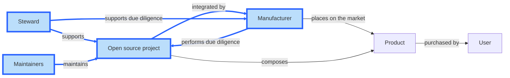

# Cyber Resilience SIG 2025 Deliverables Plan

## Status of this document

This document is a draft proposal that is meant to foster discussions. It will need to be ratified by the Steering Committee to be formally adopted by the Cyber Resilience SIG.

## Scope

In 2025, the Cyber Resilience SIG will focus on deliverables necessary to help the open source community meet the regulatory obligations outlined in the European Cyber Resilience Act (CRA) and help downstream users be able to continue leveraging open source in their products and services while meeting their own regulatory requirements.

This is expressed by the nodes and edges in blue in the diagram below.

## Areas of focus

## Resources
