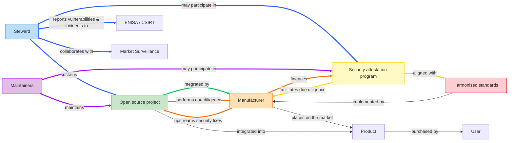
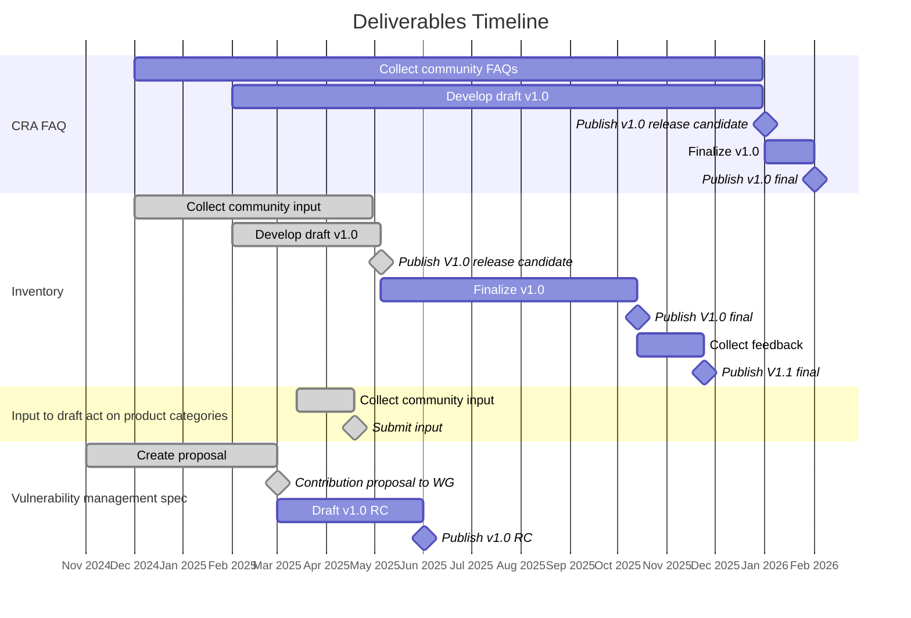

# Deliverables Plan

In 2025, the [Cyber Resilience SIG][SIG] will focus on deliverables necessary to help the open source community (and notably _open source software stewards_) meet the regulatory obligations outlined in the CRA and help downstream users (_manufacturers_) be able to continue to leverage open source in their products and services while meeting their own regulatory requirements. This is expressed by the colored nodes and edges in the diagram below.

## Deliverables

 🗺️ Planned | ✍️ Work in Progress | 🚀 Shipped! | ❌ Cancelled

| | Deliverable name | Owner | First draft due | Final draft due |
|---:|---|---|---|---|
| **1.** | **Documentation** | | | |
| ✍️ | 1.1 [CRA FAQ][FAQ] | [FAQ Task Force][] | April 2025 | Dec 2025 |
| ✍️ | 1.2 [Inventory][] | [Inventory Task Force][] | April 2025 | Sept 2025 |
| | | | | |
| **2.** | **Inputs & contributions** | | | |
| 🚀 | 2.1 [Input to draft implementing act on product categories][input product categories] | [Cyber Resilience SIG][SIG] | March 18, 2025 | April 18, 2025 |
| 🚀 | 2.2 [Contribution to Vulnerability Handling Standard Clause 4.4][deliverable-2-2] | [Cyber Resilience SIG][SIG] | May 13, 2025 | May 21, 2025 |
| 🚀 | 2.3 [Contribution to open source EU Guidance on open source hardware][deliverable-2-3] | [Open Source Hardware Task Force][] | May 30, 2025 | June 16, 2025 |
| ❌ | ~~2.4 [Contribution to Vulnerability Handling Standard Annex C][deliverable-2-4]~~ | ~~[Vulnerability Handling Task Force][]~~ | ~~June 30, 2025~~ | |
| 🚀 | 2.5 [Comments on CEN/CENELEC PT 1 Standard][deliverable-2-5] | [CEN/CENELEC WG 9 PT 1 liaisons][CEN/CENELEC WG 9 PT 1] | June 12, 2025 |June 12, 2025 |
| 🚀 | 2.6 [Feedback on Cybersecurity Act (CSA) Revision][deliverable-2-6] | [Cyber Resilience SIG][SIG] | June 14, 2025 | June 20, 2025 |
| 🚀 | 2.7 [Comments to EU Guidance on open source][deliverable-2-7] | [CRA Expert Group liaisons][CRA Expert Group] | June 18, 2025 | June 20, 2025 |
| 🚀 | 2.8 [Response to the Call for evidence on the revision of the Standardisation Regulation 1025][deliverable-2-8] | [Cyber Resilience SIG][SIG] | July 5, 2025 | July 21, 2025 |
| 🚀 | 2.9 [Comments on CEN/CENELEC PT3 Vulnerability Handling Standard][deliverable-2-9] | [Cyber Resilience SIG][SIG] | July 20, 2025 | August 4, 2025 |
| | | | | |
| **3.** | **White papers** | | | |
| 🗺️ | 3.1 [White paper on SBOMs][SBOMs] | Dedicated task force | April 2025 | June 2025 |
| 🗺️ | 3.2 [White paper on due diligence obligation of manufacturers][due diligence] | Dedicated task force | | |
| 🗺️ | 3.3 [White paper on security attestations][security attestations] | Dedicated task force | | |
| 🗺️ | 3.4 [White paper on types of open source projects][open source project types] | [Cyber Resilience SIG][SIG] | | |
| ✍️ | 3.5 [White paper on open source software stewards and CRA][open source stewards cra] | [Vulnerability Handling Task Force][] | | |
| | | | | |
| **4.** | **Specifications** | | | |
| ✍️ | 4.1 [Vulnerability management specification][vulnerability management] | [Cyber Resilience Practices Project][] | March 2025 | |
| 🗺️ | 4.2 [Specification on principles for cyber resilience for open source development][cyber resilience principles] | [Cyber Resilience Practices Project][] | | |
| 🗺️ | 4.3 [Specification on generic security requirements for open source components][generic security requirements] | [Cyber Resilience Practices Project][] | | |
| 🗺️ | 4.4 [Security policy for open source software stewards][security policy] | [Cyber Resilience Practices Project][] | | |

_Note that the [Cyber Resilience SIG][SIG] is empowered to create additional white papers to address pressing issues, support existing deliverables, or provided input to the [European Commission][EU Commission], [ENISA][], the [CRA Expert Group][], the [European Standards Organisations][ESOs], [Market Surveillance Authorities][Market Surveillance], or any other relevant institution._

## Key stakeholders

The [Cyber Resilience SIG][SIG] intends to collaborate closely with and provide input to the following stakeholders:

* EU Commission
* CRA Expert Group
* CEN/CENELEC
* ETSI
* ENISA
* Market Surveillance Authorities

## Equivalence between products and open source components

The CRA focuses mainly on the compliance of products, but that doesn't mean that there aren't equivalent concepts targeted at open source components. The following table compares products and open source components and references relevant [Cyber Resilience SIG][SIG] deliverables for each.

| Role | For products | Equivalent for open source components | Relevant deliverables |
|---|---|---|---|
| **Compliance requirements** | Ensure product is designed, developed and produced in accordance with the essential cybersecurity requirements | Exercise due diligence | [White paper on due diligence][due diligence] | 
| **Helps meet compliance requirements** | CEN/CENELEC and ETSI harmonised standards | TBD | [Principles for cyber resilience][cyber resilience principles] and [Generic security requirements][] specs |
| **Indicates compliance** | CE Mark | Security Attestation | [White paper on attestations][security attestations] | 
| **Provides information to users** | Technical documentation | TBD | [Principles for cyber resilience][cyber resilience principles] and [Generic security requirements][] specs |
| **Manage vulnerabilities** | CEN/CENELEC and ETSI harmonised standards | ORC WG specification | [Vulnerability management spec][vulnerability management] |

[EFSL]: https://www.eclipse.org/legal/efsl/

[SIG]: ./README.md
[TFs]:                               ./README.md#current-task-forces
[Deliverables Plan Task Force]:      ./task-forces/deliverables-plan-tf/
[FAQ Task Force]:                    ./task-forces/faq-tf/
[Inventory Task Force]:              ./task-forces/inventory-tf/
[Vulnerability Handling Task Force]: ./task-forces/vulnerability-handling-tf/
[Open Source Hardware Task Force]:   ./task-forces/open-source-hardware-tf/
[Cyber Resilience Practices Project]: ./README.md#cyber-resilience-practices-project

[Article 13(5)]: https://eur-lex.europa.eu/legal-content/EN/TXT/HTML/?uri=OJ:L_202402847#art_13
[Article 24(1)]: https://eur-lex.europa.eu/legal-content/EN/TXT/HTML/?uri=OJ:L_202402847#art_24
[Article 25]: https://eur-lex.europa.eu/legal-content/EN/TXT/HTML/?uri=OJ:L_202402847#art_25
[Annex I, Part I, point (1)]: https://eur-lex.europa.eu/legal-content/EN/TXT/HTML/?uri=OJ:L_202402847#anx_I
[Annex I, Part I, point (2)]: https://eur-lex.europa.eu/legal-content/EN/TXT/HTML/?uri=OJ:L_202402847#anx_I

[FAQ]: https://github.com/orcwg/cra-hub/blob/main/faq.md
[inventory]: https://github.com/orcwg/cra-hub/blob/main/inventory.md 
[input product categories]: ./input-to-draft-regulation-2025-04-18.xlsx
[deliverable-2-2]: coordination/cen-cenelec-wg-9/deliverable-2-2.md
[deliverable-2-3]: coordination/cra-expert-group/deliverable-2-3.md
[deliverable-2-4]: coordination/cen-cenelec-wg-9/deliverable-2-4.md
[deliverable-2-5]: coordination/cen-cenelec-wg-9/deliverable-2-5.md
[deliverable-2-6]: coordination/enisa/deliverable-2-6.md
[deliverable-2-7]: coordination/cra-expert-group/deliverable-2-7.md
[deliverable-2-8]: coordination/european-commission/2025-07-call-for-evidence-1025/deliverable-2-8.md
[deliverable-2-9]: coordination/cen-cenelec-wg-9/deliverable-2-9.md

[SBOMs]: whitepapers/sboms.md
[due diligence]: whitepapers/due-diligence.md
[security attestations]: whitepapers/security-attestations.md
[open source project types]: whitepapers/project-types.md
[open source stewards cra]: whitepapers/stewards-and-cra.md
[vulnerability management]: https://github.com/orcwg/vulnerability-management-spec
[cyber resilience principles]: proposed-specs/cyber-resilience-principles.md
[generic security requirements]: proposed-specs/generic-security-requirements.md
[security policy]: proposed-specs/security-policy.md

[EU Commission]: #key-stakeholders
[CRA Expert Group]: ./#cra-expert-group
[CEN/CENELEC]:           ./#cen-cenelec-wg-9
[CEN/CENELEC WG 9]:      ./#cen-cenelec-wg-9
[CEN/CENELEC WG 9 PT 1]: ./#cen-cenelec-wg-9
[CEN/CENELEC WG 9 PT 2]: ./#cen-cenelec-wg-9
[CEN/CENELEC WG 9 PT 3]: ./#cen-cenelec-wg-9
[ETSI]:            ./#etsi-cyber-eusr
[ETSI CYBER-EUSR]: ./#etsi-cyber-eusr
[ESOs]: #key-stakeholders
[ENISA]: #key-stakeholders
[Market Surveillance]: #key-stakeholders
