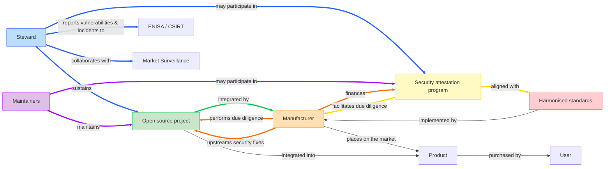
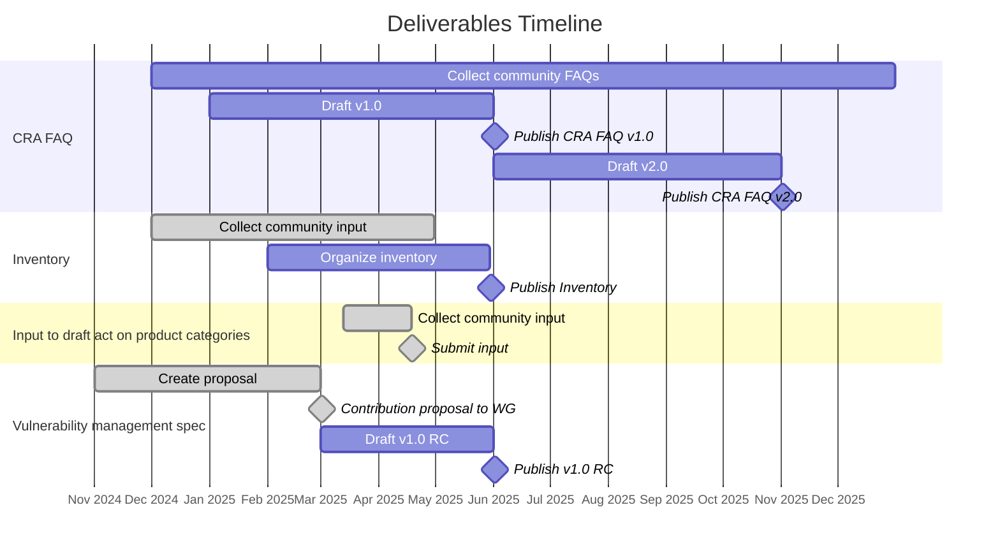

# Deliverables Plan

In 2025, the [Cyber Resilience SIG][SIG] will focus on deliverables necessary to help the open source community (and notably _open source software stewards_) meet the regulatory obligations outlined in the CRA and help downstream users (_manufacturers_) be able to continue to leverage open source in their products and services while meeting their own regulatory requirements. This is expressed by the colored nodes and edges in the diagram below.

## Deliverables

| | Deliverable name | Owner | First draft due | Final draft due |
|---:|---|---|---|---|
| **1.** | **Documentation** | | | |
| | 1.1 [CRA FAQ][FAQ] | [FAQ Task Force][] | April 2025 | June 2025 |
| | 1.2 [Inventory][] | [Inventory Task Force][] | April 2025 | June 2025 |
| | | | | |
| **2.** | **Inputs & contributions** | | | |
| 🚀 | 2.1 [Input to draft implementing act on product categories][input product categories] | [Cyber Resilience SIG][SIG] | March 18, 2025 | April 18, 2025 |
| 🚀 | 2.2 [Contribution to Vulnerability Handling Standard Clause 4.4][deliverable-2-2] | [Cyber Resilience SIG][SIG] | May 13, 2025 | May 21, 2025 |
| 🚀 | 2.3 [Contribution to open source EU Guidance on open source hardware][deliverable-2-3] | [Open Source Hardware Task Force][] | May 30, 2025 | June 16, 2025 |
| ❌ | ~~2.4 [Contribution to Vulnerability Handling Standard Annex C][deliverable-2-4]~~ | ~~[Vulnerability Handling Task Force][]~~ | ~~June 30, 2025~~ | |
| 🚀 | 2.5 [Comments on CEN/CENELEC PT 1 Standard][deliverable-2-5] | [CEN/CENELEC WG 9 PT 1 liaisons][CEN/CENELEC WG 9 PT 1] | June 12, 2025 |June 12, 2025 |
| 🚀 | 2.6 [Feedback on Cybersecurity Act (CSA) Revision][deliverable-2-6] | [Cyber Resilience SIG][SIG] | June 14, 2025 | June 20, 2025 |
| 🚀 | 2.7 [Comments to EU Guidance on open source][deliverable-2-7] | [CRA Expert Group liaisons][CRA Expert Group] | June 18, 2025 | June 20, 2025 |
| 🚀 | 2.8 [Response to the Call for evidence on the revision of the Standardisation Regulation 1025][deliverable-2-8] | [Cyber Resilience SIG][SIG] | July 5, 2025 | July 21, 2025 |
| | | | | |
| **3.** | **White papers** | | | |
| | 3.1 [White paper on SBOMs][SBOMs] | Dedicated task force | April 2025 | June 2025 |
| | 3.2 [White paper on due diligence obligation of manufacturers][due diligence] | Dedicated task force | | |
| | 3.3 [White paper on Attestations][security attestations] | Dedicated task force | | |
| | 3.4 [White paper on types of open source projects][open source project types] | [Cyber Resilience SIG][SIG] | | |
| | 3.5 [White paper Open Source Software Stewards and CRA][open source stewards cra] | [Vulnerability Handling Task Force][] | | |
| | | | | |
| **4.** | **Specifications** | | | |
| | 4.1 [Vulnerability management specification][vulnerability management] | [Cyber Resilience Practices Project][] | March 2025 | |
| | 4.2 [Specification on principles for cyber resilience for open source development][cyber resilience principles] | [Cyber Resilience Practices Project][] | | |
| | 4.3 [Specification on generic security requirements for open source components][generic security requirements] | [Cyber Resilience Practices Project][] | | |
| | 4.4 [Security policy for open source software stewards][security policy] | [Cyber Resilience Practices Project][] | | |

_Note that the [Cyber Resilience SIG][SIG] is empowered to create additional white papers to address pressing issues, support existing deliverables, or provided input to the [European Commission][EU Commission], [ENISA][], the [CRA Expert Group][], the [European Standards Organisations][ESOs], [Market Surveillance Authorities][Market Surveillance], or any other relevant institution._

### 1. Documentation

#### 1.1 CRA FAQ

The [CRA FAQ](https://github.com/orcwg/cra-hub/blob/main/faq.md) represents a community effort to collect and answer frequently asked questions about the Cyber Resilience Act (CRA) as it relates to open source.  The purpose of this effort is twofold. First, consolidate community understanding of the CRA. Secondly, outline areas of the CRA which remain unclear and would benefit from Guidance from the [European Commission][EU Commission].

A first version of the CRA FAQ will be contributed to the [CRA Expert Group][] in advance of the group's next in-person meeting on June 5, 2025.

  
More info

  
* **Source:** <https://github.com/orcwg/cra-hub/blob/main/faq.md>
* **Type:** Documentation
* **License:** CC-BY 4.0
* **Owner:** [FAQ Task Force][]
* **Input to:** EU Guidance 
* **Relevant liaisions**: [EU Commission][], [CRA Expert Group][] 
* **First draft by:** June 2025
* **Final draft by:** 
    

#### 1.2 Inventory

The goal of the [Inventory](https://github.com/orcwg/cra-hub/blob/main/inventory.md) is to provide a comprehensive list of resources that are relevant to the CRA obligations of open source software stewards and manufacturers when it comes to the development and usage of open source. The underlying purpose is to provide specification and standardization effort with easy access to documented industry and community best practices related to the development and integration of open source software and to the interactions between developers and consumers of open source.

This inventory will be contributed to [CEN/CENELEC][] and [ETSI][] and to the [CRA Expert Group][].

  
More info

  
* **Source:** <https://github.com/orcwg/cra-hub/blob/main/inventory.md>
* **Type:** Documentation
* **License:** CC-BY 4.0
* **Owner:** [Inventory Task Force][]
* **Input to:** Harmonised standards, ORC WG white papers and specifications
* **Relevant liaisions**: [CEN/CENELEC][]
* **First draft by:** May 2025
* **Final draft by:** June 2025
    

### 2. Inputs & contributions

#### 2.1 Input to the Draft EU Commission Implementing Regulation on the technical description of important and critical product

On March 13, 2025, the European Commission released draft implementing regulation on the definition of important and critical product categories and opened public consultations until April 18, 2025. The [Cyber Resilience SIG][SIG] collected community comments and feedback and [submitted it](https://ec.europa.eu/info/law/better-regulation/have-your-say/initiatives/14449-Technical-description-of-important-and-critical-products-with-digital-elements/F3536950_en) to the European Commission using the requested spreadsheet on April 18, 2025. ([Markdown version](https://github.com/orcwg/cra-hub/blob/main/product-definitions/input-to-draft-regulation.md/input-to-draft-regulation.md) | [XLSX version](./input-to-draft-regulation-2025-04-18.xlsx))

  
More info

  
* **Source:** <https://github.com/orcwg/cra-hub/tree/main/product-definitions#have-your-say---public-consultations-and-feedback>
* **Type:** Input
* **License:** CC-BY 4.0
* **Owner:** [Cyber Resilience SIG][SIG]
* **Input to:** [EU Commission][]
* **Relevant liaisions**: [EU Commission][]
* **First draft by:** March 18, 2025
* **Final draft by:** April 18, 2025
    

#### 2.2 Contribution to CEN/CENELEC Vulnerability Handling Standard Clause 4.4

The rapporteur for [CEN/CENELEC WG 9 PT 3][] requested input for the section on open source software stewards of the Vulnerability Handling Standard. Members of the [Cyber Resilience SIG][SIG] participating in PT 3 worked together to prepare a [contribution](./coordination/cen-cenelec-wg-9/deliverable-2-2.md) and submitted it to PT 3 on May 20, 2025.

  
More info

  
* **Source:** <https://github.com/orcwg/orcwg/blob/main/cyber-resilience-sig/coordination/cen-cenelec-wg-9/deliverable-2-2.md>
* **Type:** Input
* **License:** CC-BY 4.0
* **Owner:** [Cyber Resilience SIG][SIG]
* **Input to:** [CEN/CENELEC WG 9 PT 3][]
* **Relevant liaisions**: [CEN/CENELEC WG 9 PT 1][], [CEN/CENELEC WG 9 PT 3][]
* **First draft by:** May 20, 2025
* **Final draft by:** May 20, 2025
    

#### 2.3 Contribution to open source EU Guidance on open source hardware

The European Commission sought the [Cyber Resilience SIG][SIG]'s input to better understand some of the concerns raised by the open source hardware community as part of its consultation on the technical definitions of important and critical products. After consulting with members of the open source hardware community through the dedicated mailing list hosted by OpenForum Europe and some back and forth with the Commission, we agreed that the best course of action was to provide input to the Commission's Guidance on open source via the [CRA Expert Group][]. This input would clarify what open source hardware is, demonstrate its functional equivalence to open source software, and argue that it should therefore be treated as open source software under the CRA.

This [input](https://github.com/orcwg/orcwg/blob/main/cyber-resilience-sig/coordination/cra-expert-group/deliverable-2-3.md) was provided to the open source workstrand of the [CRA Expert Group][] on June 14, 2025.

  
More info

  
* **Source:** <https://github.com/orcwg/orcwg/blob/main/cyber-resilience-sig/coordination/cra-expert-group/deliverable-2-3.md>
* **Type:** Input
* **License:** CC-BY 4.0
* **Owner:** [Open Source Hardware Task Force][]
* **Input to:** EU Guidance
* **Relevant liaisions**: [EU Commission][], [CRA Expert Group][]
* **First draft by:** May 30, 2025
* **Final draft by:** June 16, 2025
    

#### ~~2.4 Contribution to CEN/CENELEC Vulnerability Handling Standard Annex C~~

  
More info

Following the delivery 2.2, the rapporteur for [CEN/CENELEC WG 9 PT 3][] asked for an informative annnex for the Vulnerability Handling Standard. This request was later rescinded. 

* **Source:** <https://github.com/orcwg/orcwg/blob/main/cyber-resilience-sig/coordination/cen-cenelec-wg-9/deliverable-2-4.md>
* **Type:** Input
* **License:** CC-BY 4.0
* **Owner:** [Vulnerability Handling Task Force][SIG]
* **Input to:** [CEN/CENELEC WG 9 PT 3][]
* **Relevant liaisions**: [CEN/CENELEC WG 9 PT 3][]
* **First draft by:** June 30, 2025
* **Final draft by:**

#### 2.5 Comments on CEN/CENELEC PT 1 Standard

As part of its process, CEN/CENELEC WG 9 PT 1 requested comments on its [Horizontal standard on General principles for cyber resilience (JT013089)](https://github.com/orcwg/cra-hub/blob/main/standards.md#milestone-1---horizontal-standards-due-august-30-2026) from its working group participants (note this was not a public call for comments).

  
More info

* **Source:** <https://github.com/orcwg/orcwg/blob/main/cyber-resilience-sig/coordination/cen-cenelec-wg-9/deliverable-2-5.md>
* **Type:** Comments
* **License:** CC-BY 4.0
* **Owner:** [CEN/CENELEC WG 9 PT 1 liaisons][CEN/CENELEC WG 9 PT 1] 
* **Input to:** [CEN/CENELEC WG 9 PT 1][]
* **Relevant liaisions**: [CEN/CENELEC WG 9 PT 1][]
* **First draft by:** June 12, 2025
* **Final draft by:** June 12, 2025

#### 2.6 Feedback on Cybersecurity Act (CSA) Revision

Provide feedback to the [EU Commission][]'s [open call for evidence](https://ec.europa.eu/info/law/better-regulation/have-your-say/initiatives/14578-The-EU-Cybersecurity-Act_en) as part of its [initiative to revise the Cybersecurity Act (CSA)](https://digital-strategy.ec.europa.eu/en/news/commission-opens-consultation-revising-eu-cybersecurity-act). Urge for a stronger technical and strategic role for ENISA in light of the [recent funding issues of the US CVE program](https://en.wikipedia.org/wiki/Common_Vulnerabilities_and_Exposures#2025_funding_issues) and the increased importance of vulnerability handling in EU legislation.

  
More info

  
* **Source:** <https://github.com/orcwg/orcwg/blob/main/cyber-resilience-sig/coordination/enisa/deliverable-2-6.md>
* **Type:** Feedback
* **License:** CC-BY 4.0
* **Owner:** [Cyber Resilience SIG][SIG]
* **Input to:** [EU Commission][]
* **Relevant liaisions**: [ENISA][], [EU Commission][]
* **First draft by:** June 14, 2025
* **Final draft by:** June 20, 2025
    

#### 2.7 Comments to EU Guidance on open source

The [EU Commission][] requested comments from the open source workstrand of the [CRA Expert Group][] on its first draft of the first part of its Guidance on open source. This was not a public call for comments.

This input was provided to the open source workstrand of the [CRA Expert Group][] on June 20, 2025.

As the draft guidance cannot be shared outside of the CRA Expert Group, neither can the comments.

  
More info

  
* **Source:** 
* **License:** 
* **Owner:** [CRA Expert Group liaisons][CRA Expert Group]
* **Input to:** EU Guidance
* **Relevant liaisions**: [CRA Expert Group][], [EU Commission][]
* **First draft by:** June 18, 2025
* **Final draft by:** June 20, 2025

#### 2.8 Response to the Call for evidence on the revision of the Standardisation Regulation 1025

The [EU Commission][] is performing the revision of the Standardisation Regulation that will address the shortcomings identified in the evaluation of the Regulation and aims to speed up the development of systemic standards for the EU's resilience and twin transition.

This input was provided to the European Commission on July 21, 2025.

  
More info

  
* **Source:** 
* **License:** 
* **Owner:** [Cyber Resilience SIG][SIG]
* **Input to:** [EU Commission][]
* **Relevant liaisions**: [EU Commission][]
* **First draft by:** July 5, 2025
* **Final draft by:** July 21, 2025

### 3. White papers

#### 3.1 White paper on SBOMs

Software Bills of Materials (SBOMs) play a crucial role in the implementation of the Cyber Resilience Act (CRA), in particular for vulnerability handling. Yet, there are no agreed-upon best practices for the usage and adoption of SBOMs across open source communities and numerous misunderstandings about how they work. There are competing standards, disagreements about whether open source projects should provide SBOMs or whether they're artifacts that integrators of open source components should generate, disagreements about the data they should contain, and a general lack of neutral information on the topic.

The goal of this white paper is to fill this gap by providing commonly agreed upon information about SBOMs and their role in the open source ecosystem and provide recommendations for their adoption in the context of the CRA.

This white paper will leverage the resources collected in the [inventory][] and will be contributed to the [EU Commission][], the [CRA Expert Group][], and [CEN/CENELEC][].

  
More info

  
* **Source:** TBD
* **Type:** White paper
* **License:** CC-BY 4.0
* **Owner:** Dedicated Task Force
* **Input to:** EU Guidance, Implementing Act, Harmonised standards
* **Relevant liaisons**: [EU Commission][], [CRA Expert Group][], [CEN/CENELEC][], [Market Surveillance][]
* **First draft by:** April 2025
* **Final draft by:** June 2025
    

#### 3.2 White paper on due diligence obligation of manufacturers

The due diligence obligation of manufacturers outlined in [Article 13(5)][] of the CRA is the cornerstone of the relationship between manufacturers and the open source ecosystem.

This white paper will attempt to clarify this obligation along with the related requirement that integrated open source components must not compromise the cybersecurity of the products they are integrated into. It will list the constraints manufacturers might face when integrating open source components—in particular components which aren't supported by open source software stewards, and propose solutions to enable manufacturers to continue leveraging open source components securely and at scale despite those constraints.

Secondly, this paper will outline steps that open source projects could take to help facilitate this due diligence obligation—notably by providing increased transparency about their security posture, recommend existing standards or specification that projects could adopt, and propose new ones where appropriate.

Finally, this paper will examine the tension between the practical necessity for manufacturers to shift security left (i.e. with the open source projects) and their inability to compel those projects to take on this responsability—given that compliance obligations rightfully rest with the manufacturers—and will underline the need for incentives-aligning mechanisms to resolve this tension.

This white paper will be shared with the [EU Commission][] and the [CRA Expert Group][] and will provide important context for the [Specification on generic security requirements for open source components][generic security requirements] described below.

Note: This white paper might be combined with the paper on [security attestations][] described below.

  
More info

  
* **Source:** TBD
* **Type:** White paper
* **License:** CC-BY 4.0
* **Owner:** Dedicated Task Force
* **Input to:** EU Guidance, Implementing Act, Harmonised standards
* **Relevant liaisons**: [EU Commission][], [CRA Expert Group][], [CEN/CENELEC][]
* **First draft by:** 
* **Final draft by:**
    

#### 3.3 White paper on security attestations

[Article 25][] of the CRA introduces security attestations for free and open-source software as a mechanism to facilitate the due diligence obligation of manufacturers when integrating open source components. While the white paper on due diligence will explore _what_ this due diligence obligation is and examine the tension between the practical necessity for manufacturers to shift security left and their inability to compel open source projects to take on this additional responsibility, this paper will explore _how_ security attestation can be used as a mechanism to resolve this tension and create incentives-alignment between manufacturers and open source projects.

Thanks to case studies of similar mechanisms, for example the [Ecosystem Sustainability Program (ESP)](https://openjsf.org/blog/ecosystem-sustainability-program) developed by the OpenJS Foundation, this paper will propose possible implementations of this mechanism that would allow open source projects and stewards to support manufacturers beyond their obligations and receive support (financial or otherwise) through the security attestation programs.

Note: This white paper might be combined with the paper on [due diligence][] described above.

  
More info

  
* **Source:** TBD
* **Type:** White paper
* **License:** CC-BY 4.0
* **Owner:** Dedicated Task Force
* **Input to:** EU Guidance, Implementing Act, Harmonised standards
* **Relevant liaisons**: [EU Commission][], [CRA Expert Group][], [CEN/CENELEC][]
* **First draft by:** 
* **Final draft by:**
    

#### 3.4 White paper on types of open source projects

The open source ecosystem is a rich ecosystem composed of very different types of projects and of communities, organizations, and maintainers supporting them. This diversity of project and community types isn't well documented and is rarely considered by policymakers. As a result, the whole open source ecosystem is often lumped together as a whole, or separated into arbitrary groups that don't match reality. The purpose of this white paper is threefold:

1. Identify important traits of open source projects that help differentiate and categorize projects into meaningful groups.
2. Define a set of categories based on those traits.
3. Provide examples of open source projects for each category and demonstrate where they fit and why.

  
More info

  
* **Source:** TBD
* **Type:** White paper
* **License:** CC-BY 4.0
* **Owner:** Cyber Resilience SIG
* **Input to:** EU Guidance, Implementing Act, Harmonised standards
* **Relevant liaisons**: [EU Commission][], [CRA Expert Group][], [CEN/CENELEC][]
* **First draft by:** 
* **Final draft by:**
    

#### 3.5 White paper Open Source Software Stewards and CRA

The Cyber Resilience Act (CRA) defines a new category of organizations, Open Source Stewards (Stewards hereafter). It also defines obligations for them that are different from those of other categories like manufacturers.

This whitepaper will aim at elaborating on the obligations, restrictions, and penalties that will be imposed to Stewards.

From the elaboration on the legal text, we will outline the missing pieces / documents / procedures that Stewards need to have to fulfil their obligations.

The goal is NOT to provide a definition or guidance about who is and who is not a steward for an Product with Digital Element qualifying as Open Source Software.

  
More info

* **Source:** https://github.com/orcwg/orcwg/blob/main/cyber-resilience-sig/whitepapers/open-source-stewards-and-cra.md
* **Type:** White paper
* **License:** CC-BY 4.0
* **Owner:** Vulnerability Handling Task Force
* **Input to:** EU Guidance, Implementing Act, Harmonised standards
* **Relevant liaisons**: [EU Commission][], [CRA Expert Group][], [CEN/CENELEC][]
* **First draft by:** TBA
* **Final draft by:** TBA

### 4. Specifications

#### 4.1 Vulnerability management specification

The [Vulnerability management specification](https://github.com/orcwg/vulnerability-management-spec/blob/main/spec.md) focuses on vulnerability management for open source codebases. It details the necessary components of a vulnerability management policy, including procedures for receiving reports, resolving issues, and disclosing vulnerabilities. Additionally, it specifies the requirements for managing vulnerable dependencies.

Although the initial motivitation for this specification is to help compliance with the essential requirements of the CRA, the intention is for this specification to be agnostic of a particular legislation.

The Vulnerability management specification, along with related input will be shared with [CEN/CENELEC][] as contribution to the [Harmonised Standard on vulnerability handling](https://github.com/orcwg/cra-hub/blob/main/standards.md#milestone-1---horizontal-standards-due-august-30-2026).

This specification will help open source softare stewards meet the obligations of their light-touch regulatory regime.

  
More info

  
* **Source:** <https://github.com/orcwg/vulnerability-management-spec/blob/main/spec.md>
* **Type:** Specification
* **License:** CC-BY 4.0 or Apache 2.0
* **Final license**: [EFSL][]
* **Owner:** [Cyber Resilience Practices Project][]
* **Input to:** Harmonised standards
* **Relevant liaisons**: [CEN/CENELEC][]
* **First draft by:** May 2025
* **Final draft by:** 
    

#### 4.2 Specification on principles for cyber resilience for open source

This specification is intended address the requirements spelled out in [Annex I, Part I, point (1)][] but specifically targeted at the development of open source components and with a focus on the due diligence obligations of manufacturers. It will build on the white papers on [SBOMS][], [due diligence][], and [security attestations][] mentioned above.

This specification aims to address the following issue:

1. Provide a specification that is freely accessible and royalty-free so that open source projects can implement it.
2. Formalize recognized good practices that improve the security posture of open source projects.
3. Provide a machine-readable way (for example through dedicated SBOM fields) for open source projects to document and transparently share factual information about the cyber resilience practices that they implement in order to faciliate the due diligence of manufacturers.
4. Help resolve the challenge of assessing risk for components whose use-cases aren't known at the time of development, by providing transparency on the project's posture to manufactueres integrating them, allowing them to carry out their own risk assessment as part of their due diligence obligations.

Where appropriate, this specification will reference and build on existing material, notably collected in the [inventory][]. It may be broken down into separare documents or combined with the [Specification on generic security requirements for open source components][generic security requirements] detailed below to specify a "broad vertical."

Note: The challenge of assessing risk for components whose use-cases aren't known at the time of development might benefit from its own white paper.

  
More info

  
* **Source:** 
* **Type:** Specification
* **License:** CC-BY 4.0 or Apache 2.0
* **Final license**: [EFSL][]
* **Owner:** [Cyber Resilience Practices Project][]
* **Input to:** ISO
* **Relevant liaisons**: [EU Commission][], [CRA Expert Group][], [CEN/CENELEC][]
* **First draft by:**
* **Final draft by:** 
    

#### 4.3 Specification on generic security requirements for open source components

This specification is intended to addresses the requirements spelled out in [Annex I, Part I, point (2)][] but specifically targeted at open source components and with a focus on the due diligence obligations of manufacturers. It will build on the white papers on [SBOMS][], [due diligence][], and [security attestations][] mentioned above and work closely with the [Specification on principles for cyber resilience for open source development][cyber resilience principles] mentioned above.

This specification will provide a machine-readable way (for example through dedicated SBOM fields) for open source projects to document and transparently share factual information about which cyber security requirements defined in [Annex I, Part I, point (2)][] are relevant to the project, whether they are addressed by the project, or whether they need to be handled by the integrator.

Where appropriate, this specification will reference and build on existing material, notably collected in the [inventory][]. It may be broken down into separare documents or combined with the [Specification on principles for cyber resilience for open source][cyber resilience principles] detailed above to specify a "broad vertical."

  
More info

  
* **Source:** 
* **Type:** Specification
* **License:** CC-BY 4.0 or Apache 2.0
* **Final license**: [EFSL][]
* **Owner:** [Cyber Resilience Practices Project][]
* **Input to:** ISO
* **Relevant liaisons**: [EU Commission][], [CRA Expert Group][], [CEN/CENELEC][]
* **First draft by:**
* **Final draft by:** 
    

#### 4.4 Security policy for open source software stewards

[Article 24(1)] of the CRA states that _"open-source software stewards shall put in place and document in a verifiable manner a cybersecurity policy to foster the development of a secure product with digital elements as well as an effective handling of vulnerabilities by the developers of that product."_ This specification will help open source software stewards meet their obligations by specifying minimum requirements that stewards must implement to meet them and provide a structure or format to document their cybersecurity  policy, possibly in a machine-readable way.

This specification will leverage existing resources and best practies as identified in our [inventory][] and will interact closely with the [Vulnerability management specification][vulnerability management] and the [Specification on principles for cyber resilience for open source development][cyber resilience principles] described above.

This specification will help open source softare stewards meet the obligations of their light-touch regulatory regime.

  
More info

  
* **Source:** 
* **Type:** Specification
* **License:** CC-BY 4.0 or Apache 2.0
* **Final license**: [EFSL][]
* **Owner:** [Cyber Resilience Practices Project][]
* **Input to:** ISO
* **Relevant liaisons**: [EU Commission][], [CRA Expert Group][], [CEN/CENELEC][]
* **First draft by:** May 2025
* **Final draft by:** 
    

## Key stakeholders

The [Cyber Resilience SIG][SIG] intends to collaborate closely with and provide input to the following stakeholders:

* EU Commission
* CRA Expert Group
* CEN/CENELEC
* ETSI
* ENISA
* Market Surveillance Authorities

## Equivalence between products and open source components

The CRA focuses mainly on the compliance of products, but that doesn't mean that there aren't equivalent concepts targeted at open source components. The following table compares products and open source components and references relevant [Cyber Resilience SIG][SIG] deliverables for each.

| Role | For products | Equivalent for open source components | Relevant deliverables |
|---|---|---|---|
| **Compliance requirements** | Ensure product is designed, developed and produced in accordance with the essential cybersecurity requirements | Exercise due diligence | [White paper on due diligence][due diligence] | 
| **Helps meet compliance requirements** | CEN/CENELEC and ETSI harmonised standards | TBD | [Principles for cyber resilience][cyber resilience principles] and [Generic security requirements][] specs |
| **Indicates compliance** | CE Mark | Security Attestation | [White paper on attestations][security attestations] | 
| **Provides information to users** | Technical documentation | TBD | [Principles for cyber resilience][cyber resilience principles] and [Generic security requirements][] specs |
| **Manage vulnerabilities** | CEN/CENELEC and ETSI harmonised standards | ORC WG specification | [Vulnerability management spec][vulnerability management] |

[EFSL]: https://www.eclipse.org/legal/efsl/

[SIG]: ./README.md
[TFs]:                               ./README.md#current-task-forces
[Deliverables Plan Task Force]:      ./README.md#deliverables-plan-tf
[FAQ Task Force]:                    ./README.md#faq-tf
[Inventory Task Force]:              ./README.md#inventory-tf
[Vulnerability Handling Task Force]: ./README.md#vulnerability-handling-tf
[Open Source Hardware Task Force]:   ./README.md#open-source-hardware-tf
[Cyber Resilience Practices Project]: ./README.md#cyber-resilience-practices-project

[Article 13(5)]: https://eur-lex.europa.eu/legal-content/EN/TXT/HTML/?uri=OJ:L_202402847#art_13
[Article 24(1)]: https://eur-lex.europa.eu/legal-content/EN/TXT/HTML/?uri=OJ:L_202402847#art_24
[Article 25]: https://eur-lex.europa.eu/legal-content/EN/TXT/HTML/?uri=OJ:L_202402847#art_25
[Annex I, Part I, point (1)]: https://eur-lex.europa.eu/legal-content/EN/TXT/HTML/?uri=OJ:L_202402847#anx_I
[Annex I, Part I, point (2)]: https://eur-lex.europa.eu/legal-content/EN/TXT/HTML/?uri=OJ:L_202402847#anx_I

[FAQ]: #11-cra-faq
[inventory]: #12-inventory 
[input product categories]: #21-input-to-the-draft-eu-commission-implementing-regulation-on-the-technical-description-of-important-and-critical-product
[deliverable-2-2]: #22-contribution-to-cencenelec-vulnerability-handling-standard-clause-44
[deliverable-2-3]: #23-contribution-to-open-source-eu-guidance-on-open-source-hardware
[deliverable-2-4]: #24-contribution-to-cencenelec-vulnerability-handling-standard-annex-c
[deliverable-2-5]: #25-comments-on-cencenelec-pt-1-standard
[deliverable-2-6]: #26-feedback-on-cybersecurity-act-csa-revision
[deliverable-2-7]: #27-comments-to-eu-guidance-on-open-source
[deliverable-2-8]: #28-response-to-the-call-for-evidence-on-the-revision-of-the-standardisation-regulation-1025

[SBOMs]: #31-white-paper-on-sboms
[due diligence]: #32-white-paper-on-due-diligence-obligation-of-manufacturers
[security attestations]: #33-white-paper-on-security-attestations
[open source project types]: #34-white-paper-on-types-of-open-source-projects
[vulnerability management]: #41-vulnerability-management-specification
[cyber resilience principles]: #42-specification-on-principles-for-cyber-resilience-for-open-source 
[generic security requirements]:#43-specification-on-generic-security-requirements-for-open-source-components
[security policy]: #44-security-policy-for-open-source-software-stewards

[EU Commission]: #key-stakeholders
[CRA Expert Group]: ./#cra-expert-group
[CEN/CENELEC]:           ./#cen-cenelec-wg-9
[CEN/CENELEC WG 9]:      ./#cen-cenelec-wg-9
[CEN/CENELEC WG 9 PT 1]: ./#cen-cenelec-wg-9
[CEN/CENELEC WG 9 PT 2]: ./#cen-cenelec-wg-9
[CEN/CENELEC WG 9 PT 3]: ./#cen-cenelec-wg-9
[ETSI]:            ./#etsi-cyber-eusr
[ETSI CYBER-EUSR]: ./#etsi-cyber-eusr
[ESOs]: #key-stakeholders
[ENISA]: #key-stakeholders
[Market Surveillance]: #key-stakeholders
