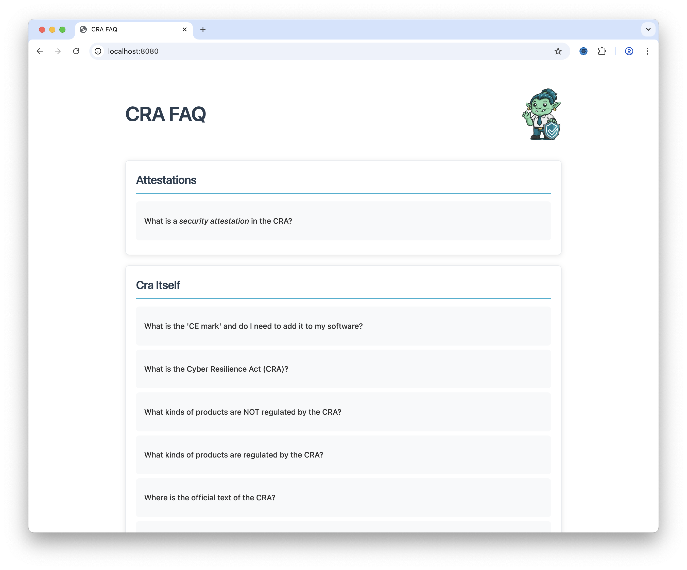
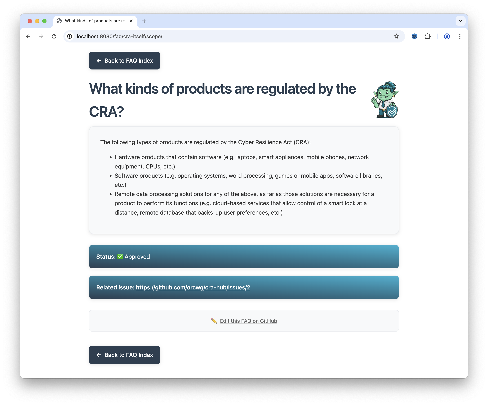
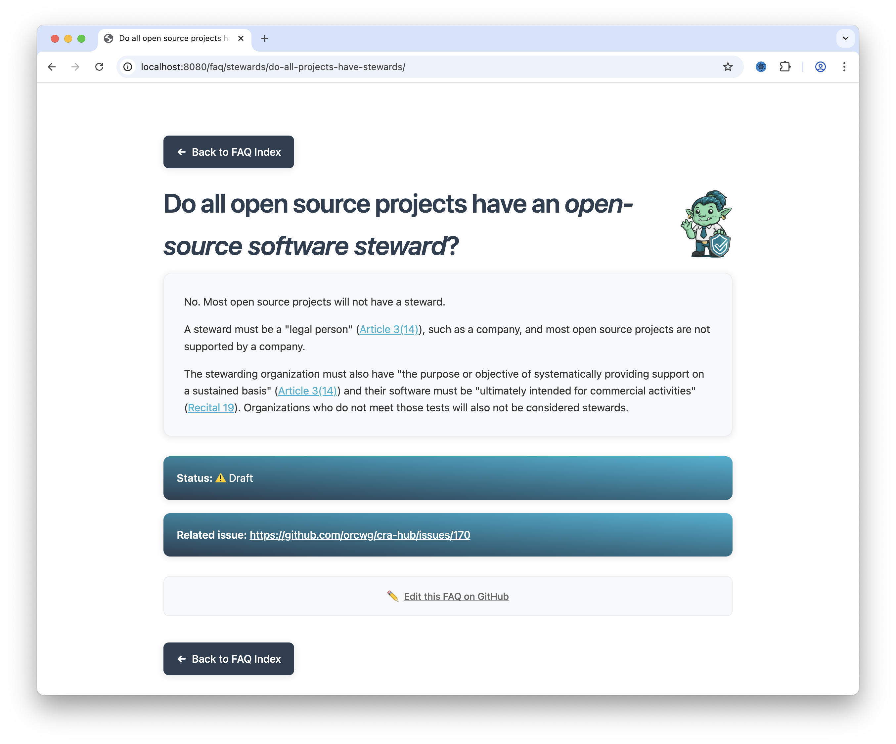

##  Agenda

| Min | Agenda Topics | Moderator |
| --: | ----- | --- |
|   0 | Welcome & approve agenda | Tobie |
|   3 | Approve minutes for [September 5](./2025-09-05-mom-faq-tf.md) ([pull request](https://github.com/orcwg/orcwg/pull/178)) | Tobie |
|   5 | [Pending action items](#pending-action-items) from last TF call | Tobie |
|  10 | Housekeeping: [find new meeting time](https://github.com/orcwg/orcwg/issues/174) | Tobie |
|  15 | Status update ([roadmap][]) | Tobie |
|  20 | |  |
|  25 | Discuss [proposed goals][goals] & [review process][review] | Tobie |
|  30 |  CRA Hub sneak peek | Ninn |
|  35 | | |
|  40 | | |
|  45 | | |
|  50 | | |
|  55 | AOB | |

## Pending action items
- None

## Participants

* Tobie Langel (UnlockOpen)  
* Timo Perälä (Nokia)  
* Martin von Willebrand (Double Open)  
* Roman Zhukov (Red Hat)  
* Ninn Langel (UnlockOpen)  
* Salve J. Nilsen (CPANSec)

## Minutes

### Welcome & approve agenda

* Approved, no AOBs

### Approve minutes for September 5

* September 5 ([PR](https://github.com/orcwg/orcwg/pull/178))  
* Approved and merge

### Pending action items from last TF call

* None

### Housekeeping: find new meeting time

* [find new meeting time](https://github.com/orcwg/orcwg/issues/174)  
* Hard to find a time because of CEN/CENELEC comment review activity  
* Tobie to propose a few options

### Status update

* [Roadmap](https://github.com/orcwg/cra-hub/issues/262)  
* We need to discuss v1.1 (what happens after FOSDEM)
* Treat as open source project that is continuously updated and improved
* We’ll have to plan for how we handle the V1 release:
  * Process  
  * V1 vs bleeding edge in parallel?  
  * Etc.  
* Keep this discussion going as the project evolves in the upcoming months   
* We'll also want to think about a longer timeline
* Plan for 2026? Rolling release process? Cadence?

### Discuss proposed goals & review process

* [proposed goals](https://github.com/orcwg/cra-hub/tree/main/faq/README.md#goals)  
  * General agreement with the proposed goals  
* [review process](https://github.com/orcwg/cra-hub/tree/main/faq/README.md#review)  
  * Suggestion to defer until we start reviewing

### CRA Hub sneak peek

* Ninn demoed an early version of the CRA Hub
* Built directly from the `cra-hub` repo using a static website generator (Eleventy)
* Can be deployed on GitHub's infrastructure (GitHub Pages)
* Will be released under an Apache 2.0 license soon
* Here's a few screengrabs for those who missed the demo:

### AOB

* None

[review]: https://github.com/orcwg/cra-hub/tree/main/faq/README.md#review
[goals]: https://github.com/orcwg/cra-hub/tree/main/faq/README.md#goals
[roadmap]: https://github.com/orcwg/cra-hub/issues/262

