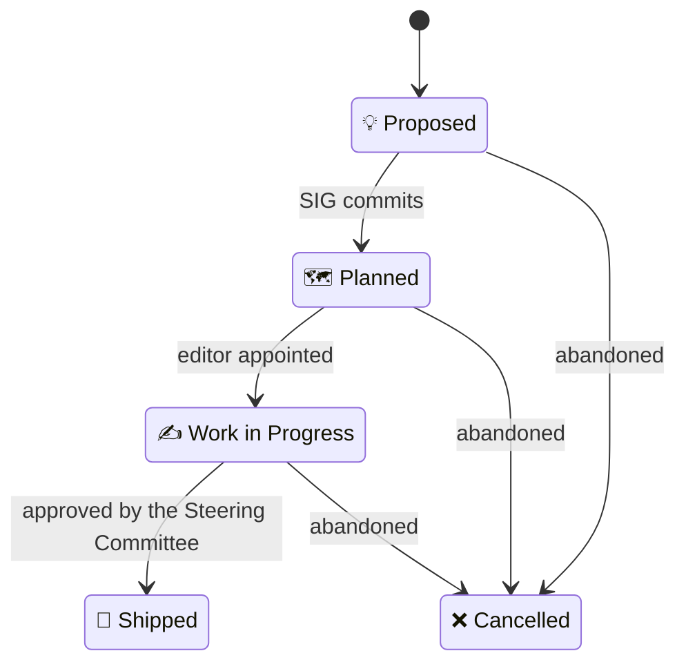

# ORC WG Working Mode

This document captures how the ORC WG operates. It can be amended or broken down into smaller policies and processes as needed.

## Applicable documents

The ORC WG is subject to its [charter](https://www.eclipse.org/org/workinggroups/open-regulatory-compliance-charter.php) and the various documents it references, in particular: the Eclipse Foundation Working Group [Process](https://www.eclipse.org/org/workinggroups/process.php) and [Operations Guide](https://www.eclipse.org/org/workinggroups/operations.php).

## Special Interest Groups

The ORC WG organizes its domain-specific work into thematic Special Interest Groups (SIGs), each focused on a specific area of regulation impacting open source. The current SIGs are listed in the [main README](README.md#special-interest-groups-sigs).

### Repository structure

Each SIG has its own root folder at the repository top level (e.g. `cyber-resilience-sig/`). Inside, a SIG is typically organized as follows:

- `README.md` — SIG overview: leads, task forces, liaisons.
- `deliverables.md` — the SIG's deliverables plan.
- `minutes/` — SIG plenary meeting minutes.
- `task-forces/[task-force]/` — one folder per task force, each with its own `minutes/`.
- `coordination/[liaison-group]/` — coordination notes and deliverables for each external liaison group; may contain dated subfolders to bundle a deliverable with its supporting artifacts (e.g. PDFs).
- `whitepapers/` — analytical white papers.
- `proposed-specs/` — proposed technical specifications.

Frontmatter and file name conventions for the files in these folders are defined in [`document-metadata.md`](document-metadata.md). Consistent metadata allows these documents to be ingested elsewhere, for example on the website.

### Deliverables

A substantial part of a SIG's work is responding to external input requests (calls for evidence, consultations, requests for feedback, etc.) through submissions and producing documentation, position papers, and white papers on topics within its scope. These deliverables follow the process and structure defined below. Their metadata schemas are defined in [`document-metadata.md`](document-metadata.md#deliverables).

Normative technical specifications, on the other hand, follow a dedicated process and require an [Eclipse open source project](https://www.eclipse.org/projects/dev_process/) to host these specifications and develop them with guidance from the SIG; see for example the [Cyber Resilience Practices Project](cyber-resilience-sig/README.md#cyber-resilience-practices-project).

#### Deliverables lifecycle

Deliverables are added to a SIG's deliverables plan by the SIG itself.

A SIG's deliverables plan must be approved by the [Steering Committee](governance/steering-committee), usually annually. It can be amended throughout the year as needed; for example, to respond to new submission requests.

SIGs are empowered to create additional submissions, position papers, or white papers within their scope to address pressing issues, support existing deliverables, or provide input to their stakeholders or any other relevant institution. The Steering Committee must be informed when additional submissions are created and may decide to amend or cancel them.

A deliverable moves through the following statuses, recorded in its `Status` field:

- `💡 Proposed` — the deliverable has been proposed but the SIG has not yet committed to producing it (e.g. evaluating whether to respond to an open external consultation).
- `🗺️ Planned` — the SIG has committed to producing this deliverable but has not yet appointed an editor for it.
- `✍️ Work in Progress` — an editor has been appointed and work on the deliverable is actively underway.
- `🚀 Shipped` — the deliverable has been completed, approved by the Steering Committee, and submitted (or published).
- `❌ Cancelled` — the deliverable has been abandoned.

#### Deliverables structure

Each deliverable type has a canonical structure provided as a template in [`templates/`](templates/):

- **Submissions**: [`templates/submission.md`](templates/submission.md)
- **White papers** (and position papers): [`templates/white-paper.md`](templates/white-paper.md)
- **Specifications**: structure is defined by the [Eclipse open source project](#deliverables) hosting them.

### Editors

Each deliverable, other than specifications, must have at least one editor. Editors are appointed by the SIG. They are responsible for advancing their deliverable and for gathering group consensus around it.

Editing requires balancing progress with fidelity to consensus: editors must keep the deliverable moving forward while respecting what they take to be the group's view at any given point. Regardless of the editor's judgment, the deliverable does not formally represent the SIG's or WG's consensus until it is formally approved by the group.

### Task forces

SIGs can form task forces that focus on a particular topic for a fixed period of time.

A task force must have one or more leads, an area of focus, a set of deliverables, and an end date by which it must present its deliverables and recommendations to the SIG and/or request an extension.

A task force's proceedings are public.

Task forces do not have any decision-making authority. Their role is advisory. Their deliverables do not represent the consensus of the SIG nor of the WG unless the SIG or WG formally adopts them.

A GitHub team is created for every task force. The task force leads are assigned the role of maintainer for that team.

## Meetings

Meetings:

- should be announced sufficiently in advance
- should be listed on [`MEETINGS.md`](https://github.com/orcwg/orcwg/blob/main/MEETINGS.md) and included in the [community calendar]([url](https://github.com/orcwg/orcwg?tab=readme-ov-file#get-involved)).
- should publish an agenda sufficiently in advance and enable membership input to it
- should have their minutes available publicly shortly after the meeting (and at least before the next meeting)

Meeting minutes:

- should list meeting participants and their affiliations
- should summarize discussion points
- should not capture every comment or question raised
- should not attribute comments to individuals
- should capture group consensus, resolutions, and action items
- should be provided in a draft format for comments
- should be approved at the latest at the beginning of the next meeting

Meeting agendas and minutes follow the structure in [`templates/meeting-notes.md`](templates/meeting-notes.md).

Note: meetings of governing bodies have additional requirements defined in the [relevant documents](#applicable-documents).

### Meeting notes lifecycle

Meeting agendas and minutes move through the following statuses, recorded in the `Status` field:

- `🗓️ Proposed agenda` — a draft agenda for an upcoming meeting, open for membership input.
- `📝 Draft` — minutes for a meeting that has occurred, available for review before approval.
- `✅ Approved` — minutes formally approved by the group, typically at the start of the following meeting.

